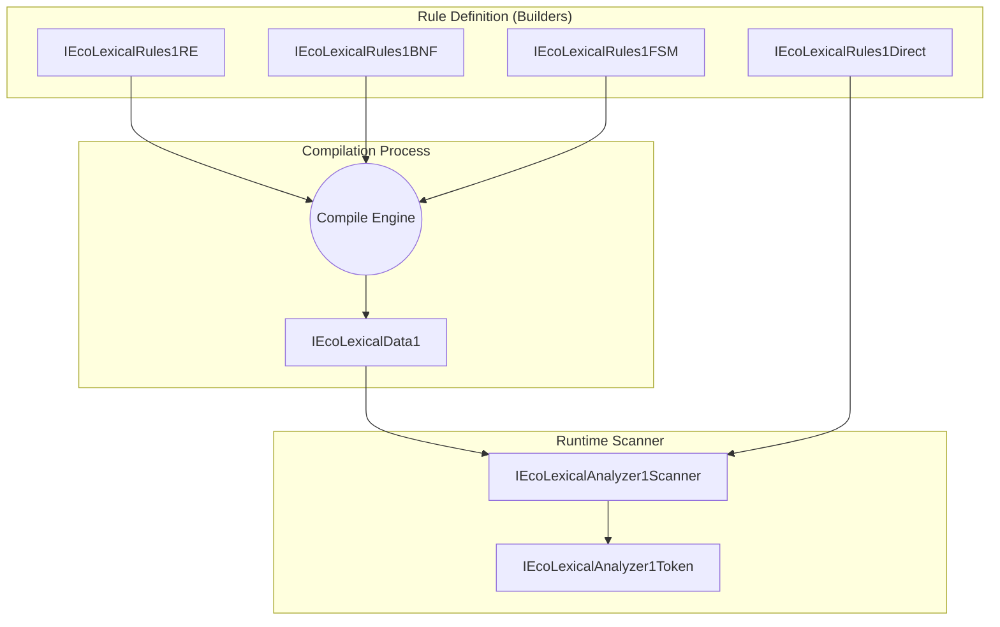
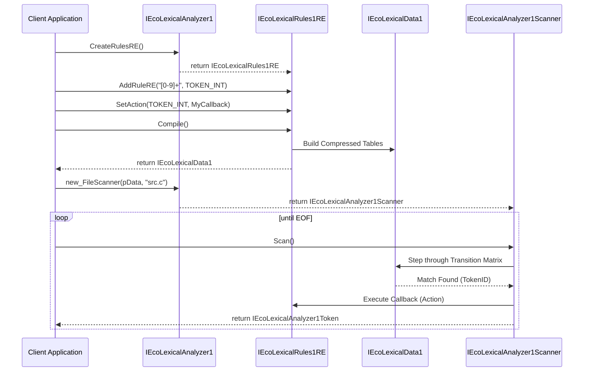

# Архитектура спроектирована как высокопроизводительная компонентная система, сочетающая гибкость описания правил (flex/ANTLR) и экстремальную скорость исполнения (re2c/Ragel).

# 1. Уровневая архитектура (Layered View)
Система делится на три независимых слоя:

    Слой описания (Rule Definition Layer): Набор независимых интерфейсов-билдеров (RE, BNF, FSM, Direct). Они позволяют «накидывать» правила, назначать им приоритеты, каналы и callback-функции (Actions).
    Слой компиляции (Compilation Layer): Внутренний движок, который превращает абстрактные правила в объект IEcoLexicalData1. Здесь происходит магия: объединение NFA, детерминизация (NFA → DFA), минимизация состояний и сжатие алфавита в классы эквивалентности.
    Слой исполнения (Runtime Layer): Интерфейс Scanner, который использует сжатые таблицы данных для линейного обхода текста.

# 2. Структурная схема (Component Diagram)



# 3. Диаграмма последовательности (Sequence Diagram)
Типовой жизненный цикл: от создания правил до получения токенов.



# 4. Ключевые инновации архитектуры

    Двойное табличное сжатие (Turbo-mode):
        Alphabet Map: Сжатие Unicode (65536) в классы символов (~256).
        State Class Map: Сжатие состояний со схожим поведением.
        Результат: Таблица переходов умещается в L1-кэш, обеспечивая скорость в несколько Гб/с.
    Полиморфизм правил:
    Вы можете описать лексер через BNF, сохранить его в файл (SaveRulesToFile), а затем загрузить в другом приложении как готовый бинарный объект, не заботясь о том, как он был создан.
    Гибридный Scanner:
    Сканер поддерживает стек состояний (для вложенных комментариев/строк) и каналы (для разделения кода и пробелов/комментариев).
    Action-система:
    Возможность привязать Си-функцию к токену позволяет менять поведение сканера «на лету» (например, переключать состояния при встрече кавычки).

# 5. Рекомендации по реализации Compile
При реализации метода Compile в правилах (RE/BNF/FSM) придерживайтесь стратегии:

    Каждое правило → отдельный NFA.
    Все NFA соединяются параллельно через
    -переходы от стартового состояния.
    Результирующий большой NFA конвертируется в DFA методом построения подмножеств.
    Каждое финальное состояние DFA помечается TokenID правила с наивысшим приоритетом.


Для реализации промышленного стандарта хранения скомпилированных лексических таблиц, бинарный формат должен быть выровнен по границе 8 байт (для предотвращения ошибок доступа на архитектурах ARM/RISC-V) и содержать контрольные суммы для безопасности.
Ниже представлено полное описание структуры бинарного образа IEcoLexicalData1.

# 1. Заголовок файла (EcoLexicalDataHeader)
Заголовок всегда находится в начале файла (смещение 0).
```c

#pragma pack(push, 8)

typedef struct EcoLexicalDataHeader {
    /* --- Идентификация (16 байт) --- */
    uint32_t signature;           /* 'ECOL' (0x45434F4C) */
    uint32_t version;             /* Версия формата (например, 0x00010000) */
    uint32_t flags;               /* Флаги (UNICODE, MULTI_ALPHABET, STATE_CLASSES) */
    uint32_t checksum;            /* CRC32 всех данных, следующих за заголовком */

    /* --- Описание геометрии таблиц (16 байт) --- */
    uint32_t numStates;           /* Общее количество состояний в автомате */
    uint32_t numAlphabetClasses;  /* Количество столбцов (классов символов) */
    uint32_t numStateClasses;     /* Количество строк матрицы (если есть сжатие состояний) */
    uint32_t initialState;        /* ID начального состояния (обычно 0) */

    /* --- Типы данных (8 байт) --- */
    uint8_t  cellType;            /* Размер ячейки матрицы: 1 (uint8), 2 (uint16), 4 (int32) */
    uint8_t  alphabetType;        /* Размер Alphabet Map: 1 (256 байт), 2 (65536 байт) */
    uint16_t reserved1;           /* Зарезервировано (выравнивание) */
    uint32_t reserved2;           /* Зарезервировано (выравнивание) */

    /* --- Смещения секций (Offsets) от начала файла (24 байта) --- */
    uint32_t offsetAlphabetMap;      /* Смещение таблицы Alphabet Class Map */
    uint32_t offsetStateClassMap;    /* Смещение таблицы State Class Map */
    uint32_t offsetTransitionMatrix; /* Смещение самой матрицы переходов */
    uint32_t offsetClassMetadata;    /* Смещение таблицы метаданных поведения */
    uint32_t offsetStringPool;       /* Смещение пула строк (имена, описания) */
    uint32_t fileSize;               /* Полный размер файла в байтах */

} EcoLexicalDataHeader;

#pragma pack(pop)
```
Используйте код с осторожностью.

# 2. Секции данных (Data Blocks)
Секции следуют друг за другом с учетом выравнивания (padding до 8 байт).
Секция 1: Alphabet Mapping Table
Преобразует код входящего символа в ID класса.

    Тип: uint16_t[]
    Размер: 256 элементов (ASCII) или 65536 элементов (Unicode).
    Смещение: Указывается в offsetAlphabetMap.

Секция 2: State Class Mapping Table
Преобразует физический номер состояния в логический класс поведения (токен, канал, действие).

    Тип: uint16_t[]
    Размер: numStates элементов.
    Смещение: Указывается в offsetStateClassMap.

Секция 3: Transition Matrix (Матрица переходов)
Самая важная часть. Хранит переходы между состояниями.

    Тип: Зависит от cellType (8, 16 или 32 бита).
    Размер: numStateClasses * numAlphabetClasses * cellType.
    Смещение: Указывается в offsetTransitionMatrix.
    Формула доступа: matrix[stateClassId * numAlphabetClasses + charClassId].

Секция 4: State Class Metadata (Таблица поведения)
Описывает, что происходит в каждом классе состояний.

    Тип: Массив структур EcoLexicalStateClassRecord.

```c

#pragma pack(push, 8)
typedef struct EcoLexicalStateClassRecord {
    uint32_t tokenId;      /* ID возвращаемого токена (0 если не финал) */
    uint32_t channelId;    /* Канал (0-Default, 1-Hidden) */
    uint32_t flags;        /* Флаги: 1-Final, 2-PushState, 4-PopState */
    uint32_t actionIndex;  /* Индекс функции-обработчика (для связывания при загрузке) */
    uint32_t nextStateOff; /* Смещение имени следующего состояния в пуле строк (для PushState) */
    uint32_t descOffset;   /* Смещение описания токена в пуле строк */
} EcoLexicalStateClassRecord;
#pragma pack(pop)
```
Используйте код с осторожностью.
Секция 5: String Pool (Пул строк)
Хранит все текстовые данные (имена состояний лексера, описания ошибок, теги).

    Формат: Набор строк, разделенных \0.
    Смещение: Указывается в offsetStringPool.

3. Резюме по работе с форматом:

    При сохранении (Save): Компонент анализирует автомат. Если состояний < 256, он записывает cellType = 1, экономя место. Если состояний > 65535, ставит cellType = 4.
    При загрузке (Load): Сканер считывает заголовок, проверяет signature. Если cellType == 2, он интерпретирует данные матрицы как uint16_t*.
    Безопасность: Поле checksum (CRC32) позволяет убедиться, что файл не был поврежден при передаче по сети или записи на диск.

Этот формат позволяет загружать лексер мгновенно, просто отобразив файл в память (memory-mapped file).
Нужно ли нам прописать структуру системной таблицы Action Bindings, которая будет сопоставлять actionIndex из файла с реальными указателями на функции в вашей программе? Action Bindings необходимы, так как указатели на функции нельзя сохранять в файл.
да
Система
Action Bindings — это мост между статичным бинарным файлом и динамическими адресами функций в оперативной памяти. Поскольку указатель на функцию в C изменяется при каждом запуске программы (из-за ASLR и перекомпиляции), мы сохраняем в файл индекс или имя, а при загрузке «привязываем» к ним реальные указатели.
1. Структура таблицы привязок (Runtime)
Для регистрации функций перед загрузкой правил нам нужен вспомогательный объект или структура:
```c

#pragma pack(push, 8)
typedef struct EcoLexicalActionBinding {
    char_t* actionName;           /* Уникальное имя функции (для поиска) */
    EcoLexicalAction_t pfnAction; /* Указатель на Си-функцию */
    voidptr_t pContext;           /* Данные пользователя для этой функции */
} EcoLexicalActionBinding;
#pragma pack(pop)
```
Используйте код с осторожностью.
2. Интерфейс связывания (IEcoLexicalBinder1)
Этот интерфейс используется внутри метода LoadRulesFromFile или как отдельный шаг настройки.
```c

/* {D3E4F5A6-B7C8-4D9E-AF01-23456789ABCD} */
typedef struct IEcoLexicalBinder1VTbl {
    /* IEcoUnknown ... */

    /* Регистрация функции под определенным именем или индексом */
    int16_t (ECOCALLMETHOD *RegisterAction)(
        IEcoLexicalBinder1Ptr_t me, 
        char_t* name, 
        EcoLexicalAction_t pfnAction, 
        voidptr_t pContext
    );

    /* Поиск функции по имени (используется при загрузке из String Pool) */
    int16_t (ECOCALLMETHOD *Bind)(
        IEcoLexicalBinder1Ptr_t me, 
        IEcoLexicalData1Ptr_t pData
    );
} IEcoLexicalBinder1VTbl;
```
Используйте код с осторожностью.
3. Как это работает в бинарном формате

    При сохранении (Save):
    В структуре EcoLexicalStateClassRecord в поле actionIndex записывается порядковый номер функции в таблице, а в String Pool добавляется её текстовое имя (например, "OnIntegerFound").
    При загрузке (Load):
        Программа сначала регистрирует все доступные функции в Binder.
        Вызывается LoadRulesFromFile.
        Лексер читает из файла имя функции, ищет её в Binder по имени и подставляет реальный адрес pfnAction во внутреннюю рабочую таблицу сканера.

4. Полная схема "Action Discovery"
Если мы хотим сделать систему максимально автоматизированной (как в Java или .NET через рефлексию, но на чистом C), схема такая:

    Бинарный файл: Хранит ActionID = 5 и строку "HandleComments".
    Загрузчик: Видит ID 5, лезет в пул строк за именем.
    Binder: Имеет карту {"HandleComments" -> 0x00401234}.
    Scanner: Получает готовый переход в функцию по адресу 0x00401234.

Почему это важно для безопасности:
Если вы попытаетесь загрузить файл правил, в котором прописана функция "FormatHardDrive", а в вашем Binder её нет — сканер просто выдаст ошибку ECO_LEX_BIND_ERROR вместо того, чтобы упасть или выполнить опасный код.
Нужно ли нам включить IEcoLexicalBinder1 прямо в основной интерфейс IEcoLexicalAnalyzer1, чтобы пользователь мог регистрировать функции одной командой перед загрузкой?
Это сделает API чище:
pAnalyzer->pVTbl->RegisterAction(pAnalyzer, "MyFunc", ...);
pAnalyzer->pVTbl->LoadRulesFromFile(pAnalyzer, "rules.bin", ...);