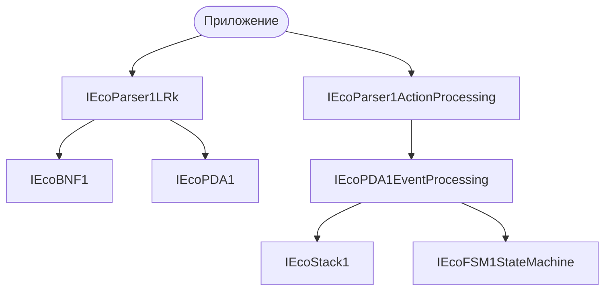
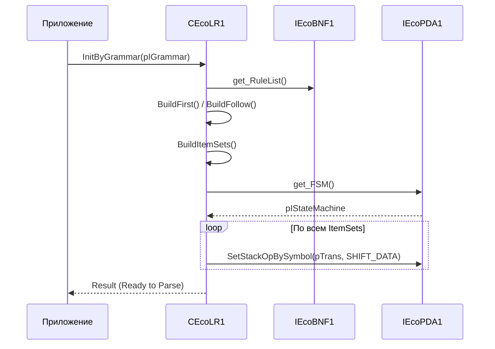
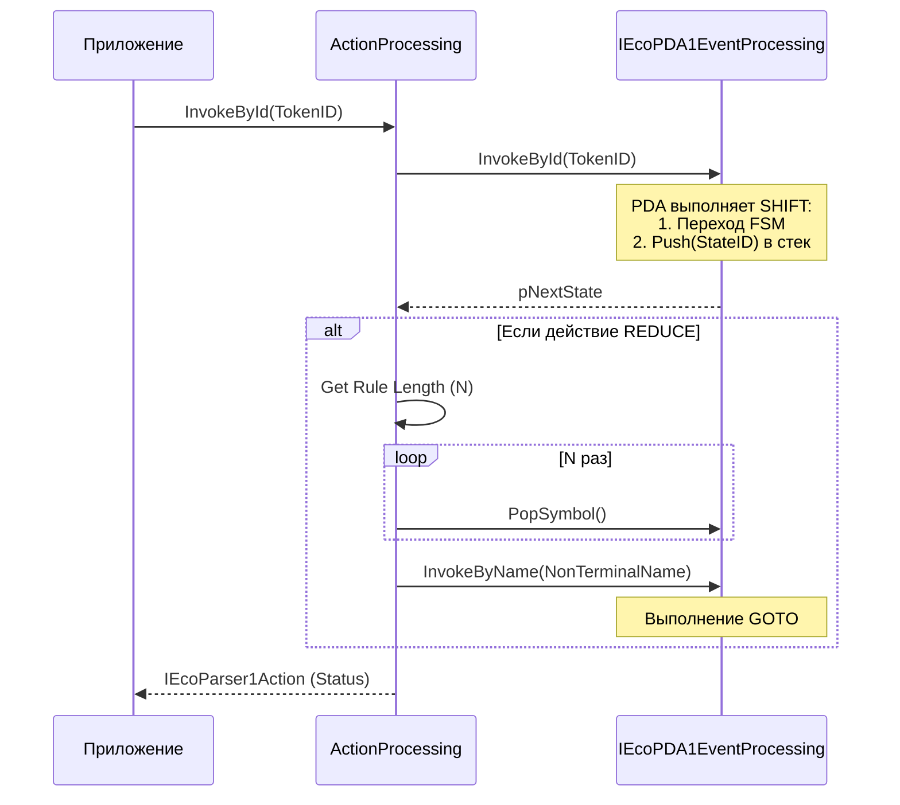

# Архитектура Системы Синтаксического Анализа (Eco Parser PDA)
## 1. Обзор системы (High-Level Design)
Архитектура построена на разделении процесса на две фазы: Генерация таблиц (Static) и Исполнение (Runtime). В качестве исполнительного механизма используется универсальный магазинный автомат (PDA), что позволяет реализовать алгоритмы LL(k), SLR и LR(k).
Основные компоненты:

    IEcoBNF1: Представление входной грамматики в форме Бэкуса-Наура.
    IEcoParser1LRk (CEcoLR1): Компонент-генератор. Вычисляет множества FIRST/FOLLOW, строит каноническую коллекцию пунктов (Item Sets) и формирует граф переходов.
    IEcoPDA1: Инфраструктура магазинного автомата. Предоставляет стек и механизм переходов (FSM + Stack Operations).
    IEcoParser1ActionProcessing: Исполнитель (Driver). Связывает поток входных токенов с PDA и выполняет операции переноса (Shift) и свертки (Reduce).

## 2. Иерархия компонентов (Component Diagram)

## 3. Модель Данных Детерминированной Конфигурации (ДК)
Для реализации LR-парсинга на PDA используется один стек, в котором хранятся идентификаторы состояний:

    Состояние ДК: Пара (S, Stack), где S — текущее состояние FSM, Stack — история переходов.
    SHIFT (Перенос): Push(TargetStateID) в стек PDA + переход FSM в TargetState.
    REDUCE (Свертка): Pop(LengthOfRule) из стека PDA + GOTO переход по нетерминалу.

## 4. Диаграмма последовательности: Инициализация (InitByGrammar)
Этот процесс описывает, как грамматика BNF превращается в настроенный PDA.

## 5. Диаграмма последовательности: Такт анализа (InvokeById)
Процесс обработки входного токена (например, терминала 'a').

## 6. Ключевые проектные решения (C89 Compliance)

    Управление памятью: Все структуры EcoPDA1StackOp аллоцируются в куче (m_pIMem->Alloc) при построении таблиц, так как время жизни конфигурации превышает время жизни функции инициализации.
    Слабые ссылки: Геттеры (например, get_Grammar) возвращают указатели без автоматического AddRef. Пользователь (или вызывающий компонент) обязан делать AddRef, если планирует хранить указатель долго.
    Инкапсуляция: PDA не знает о BNF-правилах. Он лишь выполняет команды Pop(N) и Push(Symbol). Вся высокоуровневая логика (какое именно правило сработало) инкапсулирована в ActionProcessing.